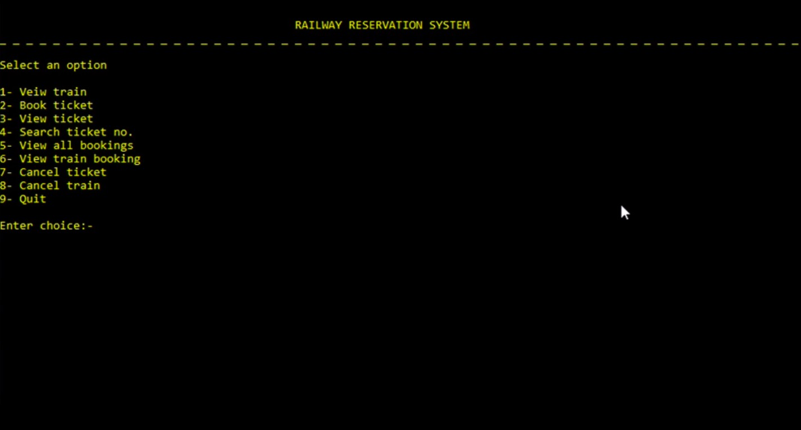
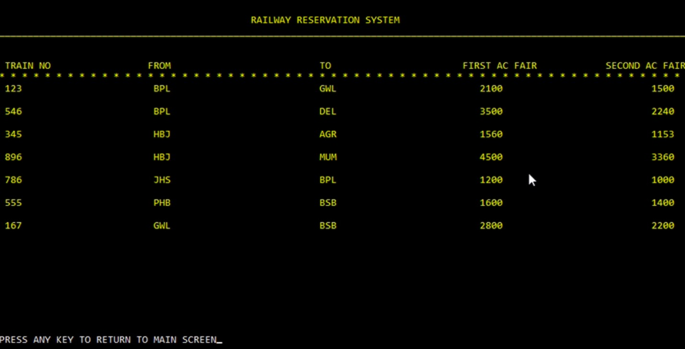
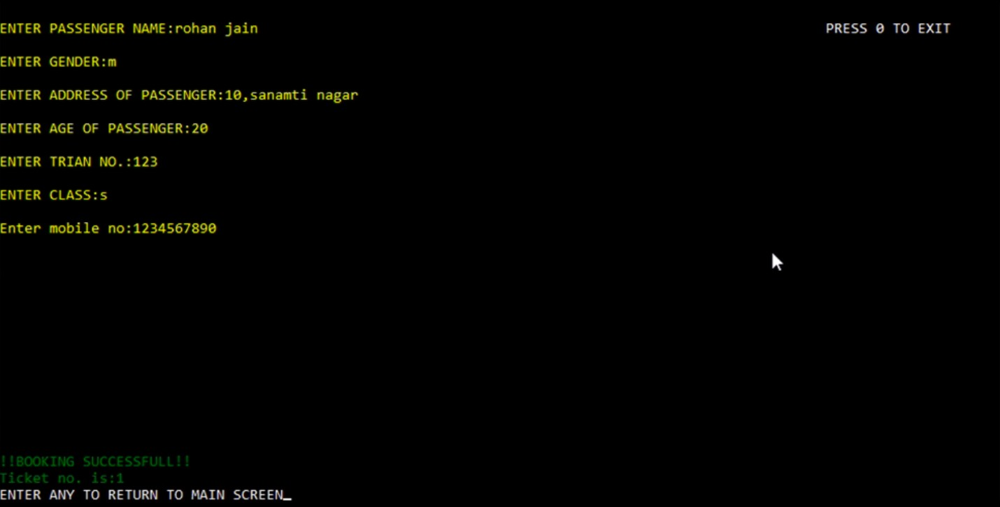

## Railway Reservation System

This is an application which can be used by the INDIAN RAILWAY for various purposes like:
-Enquiry about trains, and their status and bookings.
-Booking and Cancellation of tickets.

• Tools Used- C Language.
• For storing data, File Handling is used.

For Execution: Simply run main.c

For Demo:<a href="https://github.com/Vidhi-Jain-25/Railway_Reservation_System/Demo.html">See Demo</a>

# View of Application

